

  

<h1 align="center">Renewo</h1>

  <b>Take back control of your recurring expenses.</b> 
  A clean, fast, and thoughtful subscription manager built with Compose Multiplatform & Supabase.

  
  
  
  

---

## 📱 App Screenshots

### Dark Mode

  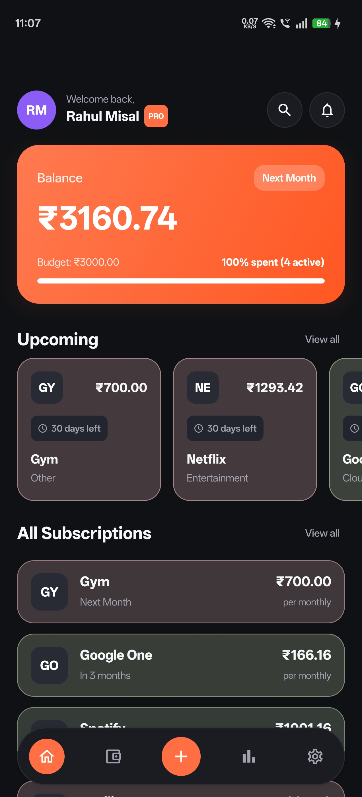
  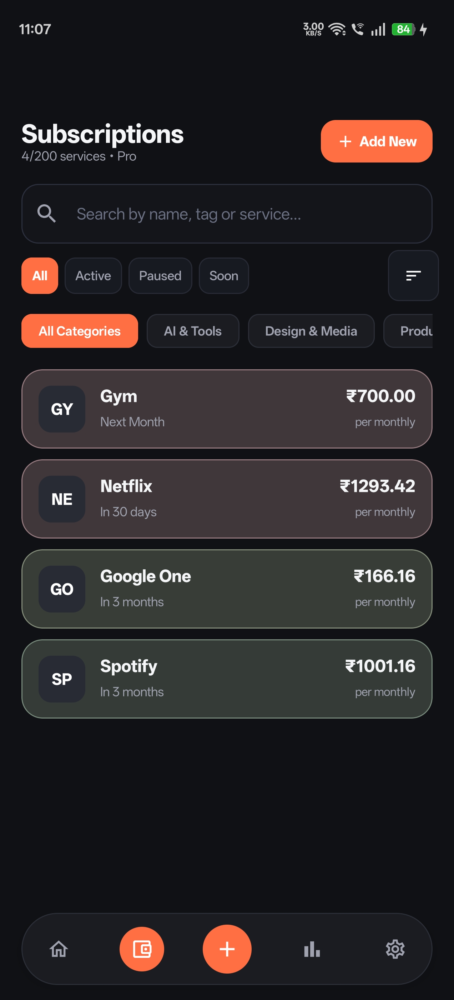
  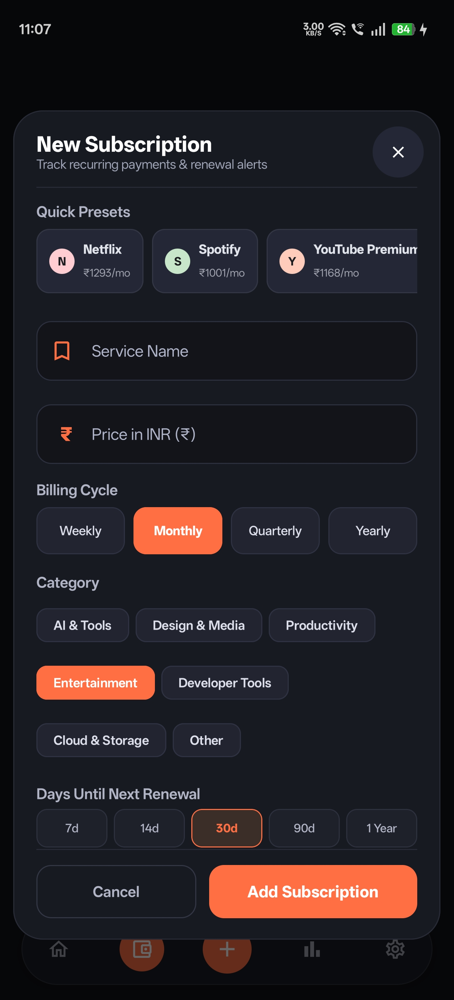
  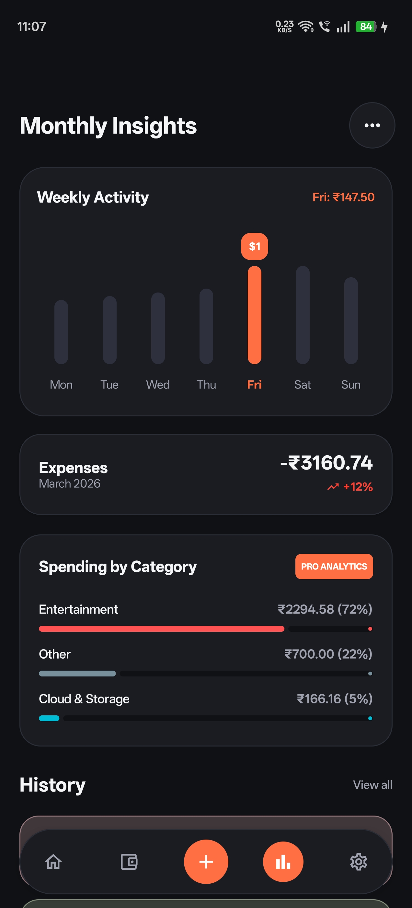
  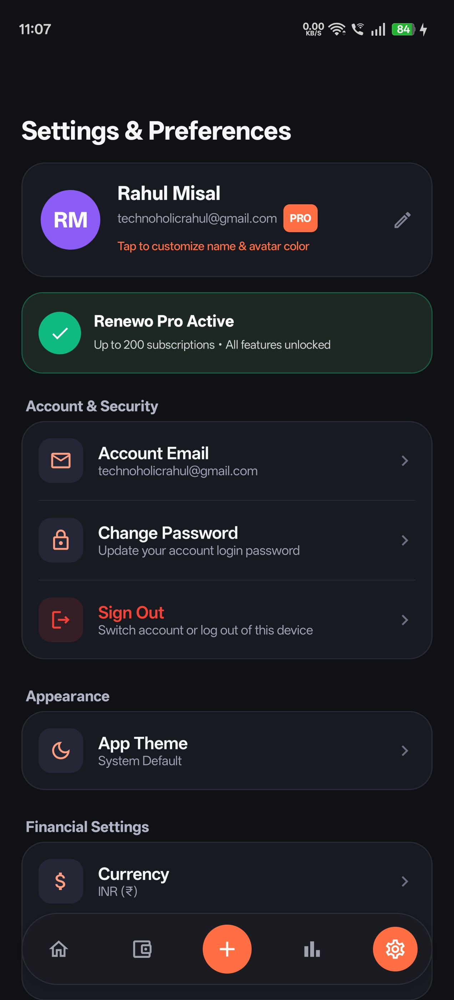

### Light Mode

  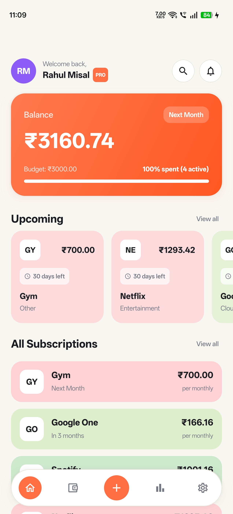
  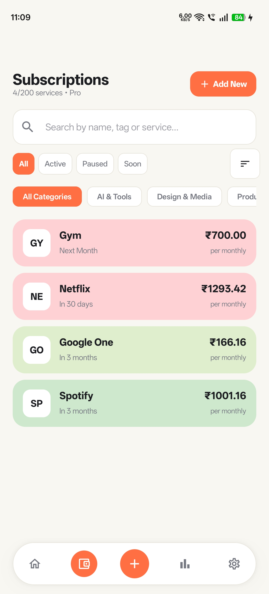
  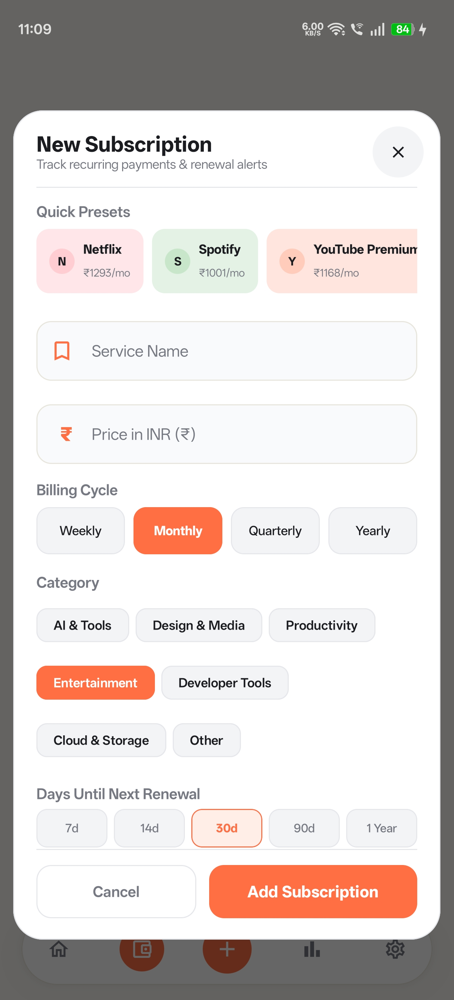
  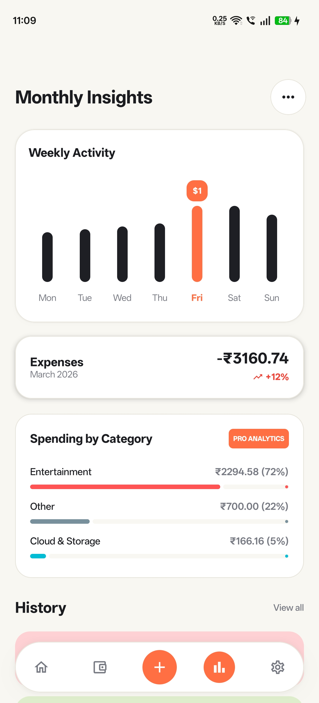
  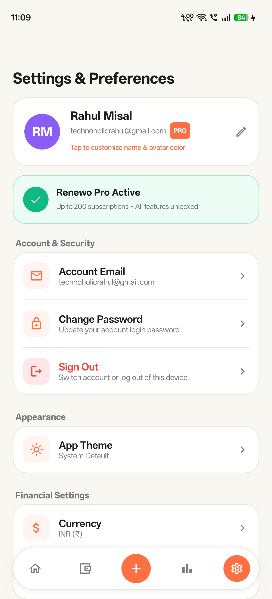

### Authentication

  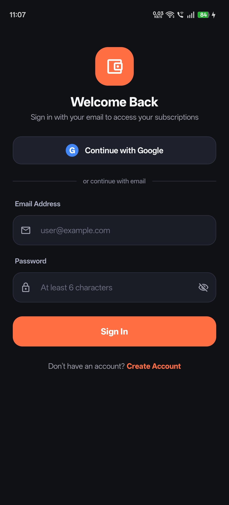
  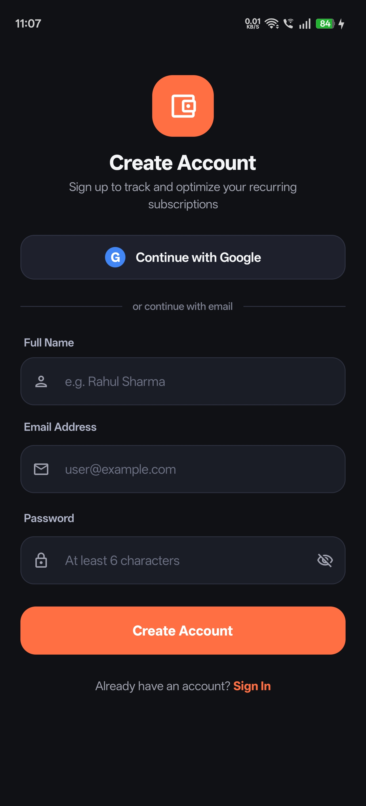
  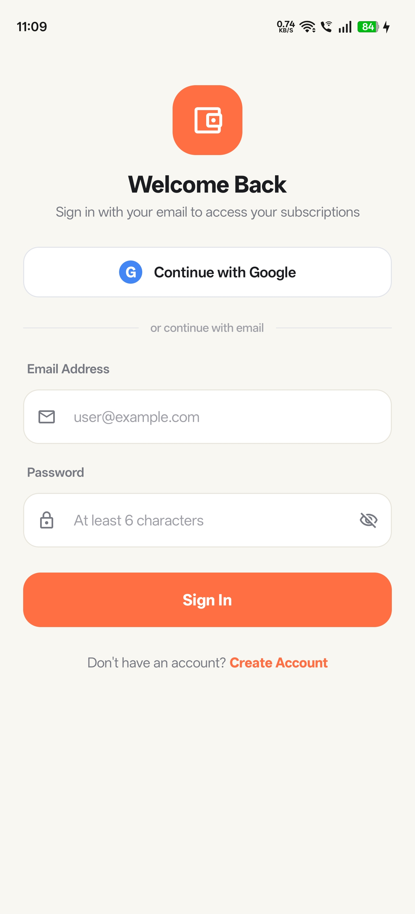
  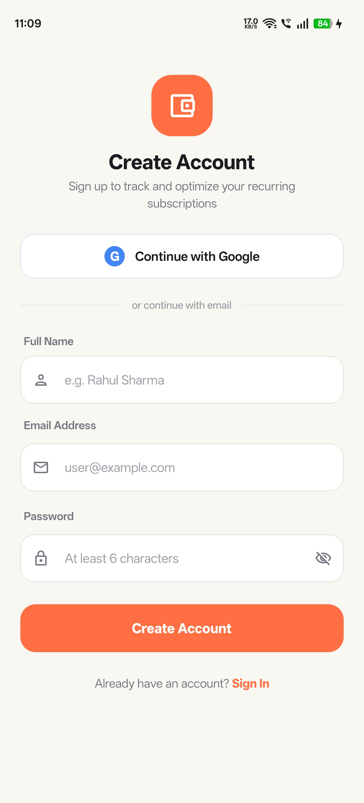

---

### Why Renewo?

Most people lose track of where their money goes each month between streaming platforms, cloud storage, software tools, and gym memberships. **Renewo** solves that. It gives you a clean, unified view of all your recurring bills, warns you before money leaves your account, and helps you stay within your monthly budget.

---

## What It Can Do

### 💳 Keep Every Subscription in One Place
- **Flexible Billing Cycles:** Supports weekly, monthly, and yearly subscriptions, automatically calculating how much you're spending every month and year.
- **1-Tap Quick Presets:** Add popular services like Netflix, Spotify, YouTube, iCloud, Prime, Google One, and ChatGPT with their native brand colors and logos pre-configured.
- **Notes & Web Links:** Jot down login account hints or plan splits directly under a subscription, and open the service website with one tap to manage or cancel it.
- **Pause Instead of Delete:** Temporarily put a subscription on hold if you're taking a break from it, without losing your billing history.
- **Custom Renewal Alerts:** Get notified 1 to 7 days before your card gets charged so you're never surprised by unexpected renewals.

### 📊 Understand Your Spending
- **Weekly & Monthly Trends:** See a visual breakdown of your daily spending trajectory, highlighting peak burn days and daily averages.
- **Category Insights:** Understand exactly how much you're spending across Entertainment, Utilities, Cloud Services, Fitness, Software, and more.
- **Monthly Budget Guard:** Set a personal monthly budget limit with a live progress indicator that lets you know when you're getting close to your ceiling.

### 🌍 Works With Your Local Currency
- Switch seamlessly between **USD ($)**, **EUR (€)**, **GBP (£)**, **INR (₹)**, **JPY (¥)**, **CAD (CA$)**, and **AUD (A$)**.
- Every single subscription dynamically normalizes to your preferred currency in real-time.

### ⚡ Fast, Offline-First & Reliable
- **Zero-Delay Startup:** Your subscriptions load immediately from device storage when you open the app. No blank screens or loading spinners.
- **Cloud Sync:** Changes automatically back up to Supabase in the background whenever you're connected.

### 💎 Basic & Pro Plans
- **Basic:** Track up to 10 subscriptions with core analytics and multi-currency support.
- **Pro:**
  - Track up to 200 active subscriptions.
  - Full analytics with all categories unlocked.
  - Export your complete data to **CSV / JSON** anytime.

---

## 👨‍💻 Built With Love By

**Rahul Misal**
- GitHub: [@CodesRahul96](https://github.com/CodesRahul96)

*Passionate about building clean, high-performance mobile apps with modern Android & Kotlin Multiplatform technologies.*

---

## 📄 License

This project is licensed under the [MIT License](LICENSE).
